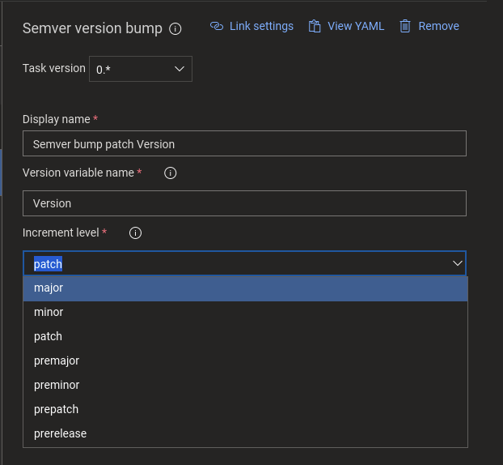

# Semantic Version Bump 
Azure DevOps Pipelines task for Builds and Releases

Bumps (increments) version saved in an environment variable.

Wraps well known [node-semver](https://github.com/npm/node-semver) library `inc()` function.

### Usage
* Define and populate variable which will hold a version
* Add a task to your pipeline
* Put the name of your version variable into "Version variable name" field
* Select desired "Increment level"
* Optionally: change "pre id" prefix

Version value is read from the configured environment variable, incremented accordingly and written back to the same variable.

:heavy_exclamation_mark: Important to understand: Azure DevOps Pipelines environment variables exists only during pipeline run and destroyed when finished. There is **no way** of persisting variable value between runs.

To continuosly increment the version its value should be persisted anywhere after increment and reloaded on next run.  
Some possible technics (for example, out of scope of this task):
* Commit as file directly to version control
* Save as artifact and get value from "last successful build"
* Discover last version from artifactory

